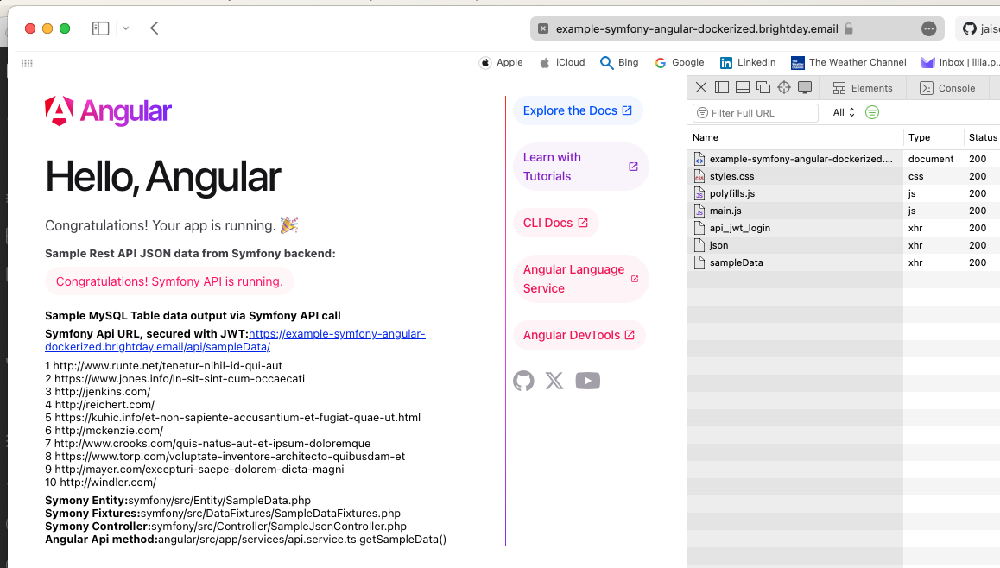

# Symfony and Angular, DB MySQL, published with Jaisocx webserver docker image




## Setup 
1. git clone git@github.com:jaisocx-org/symfony-angular-docker-setup.git
2. docker-compose build
3. docker-compose up -d
4. enter php docker container:
```
docker-compose exec php /usr/bin/env bash
```

then, inside php docker container terminal:
```
4.1. cd /var/www/symfony
4.2. composer install
4.3. php bin/console doctrine:migrations:migrate
4.4. php bin/console doctrine:fixtures:load

4.5. cd /var/www/angular
4.6. npm install
4.7. npm run build
```

5. To access this local endpoint, You need to add this line to Your /etc/hosts file:
```
127.0.0.1    example-symfony-angular-dockerized.brightday.email
```

in browser's navigation address bar, 

mouse context menu: paste and go:
```
example-symfony-angular-dockerized.brightday.email
```


6. angular start page: https://example-symfony-angular-dockerized.brightday.email/
7. symfony start page: https://example-symfony-angular-dockerized.brightday.email/api/
8. symfony sample API JSON URL: https://example-symfony-angular-dockerized.brightday.email/api/json/
9. That's all

## Development
### Symfony
1. to secure Symfony JSON URLs, 
You can use the Symfony JWT feature, 
or Jaisocx JWT feature. https://jaisocx.com/docs#auth-jwt-anchor

### Angular
2. to develop with Angular, You need to start the file watcher
```
docker compose exec php /bin/bash
cd /var/www/angular
npm run watch
```

or like this, even easy
```
./command/AngularWatch.sh
```

3. to access ng cli or npm
```
docker compose exec php /bin/bash
cd /var/www/angular
ng -v
npm -v
```

4. Data Store
```
angular/src/app/store
```

5. HttpClient fetch from Symfony backend
```
angular/src/app/services

5.1. auth.service.ts
in this example, the User credentials are hardcoded.
please, use normal login form and never hardcode user credentials for accessing secured endpoints.
login and fetch Json Web Token

User's credentials are set in Jaisocx Server config here:
docker/jaisocx-http/conf/idm-conf.xml


5.2. auth-interceptor.service.ts
the Interceptor sets Request header Authorization with JWT for all ApiService HttpClient calls.
If the JWT is not loaded, it tries to load the JWT with authService.


5.3. api.service.ts 
The service contains methods to fetch JSON data from Symfony backend.
This service uses AuthInterceptorService to set Request Authorization header.
```

### Database
It is very dangerous to make changes on docker-compose.yml file, 
the entire mysql database datafiles folder can be reset after new mysql docker container rebuild.

I'd recommend to use a standalone non-dockerized database instance, 
or to run database backups regularly, 
and obligatory, before any changes on docker-compose.yml file, 
or before executing docker-compose down --volumes.


## XDebug Symfony PHP in VSCode
- in the file ./.vscode/launch.json there is the ready to use config with this Symfony with Jaisocx setup.
- xdebug port for this project is 9007
- to choose another xdebug port, feel free to update 2 files: 
  1. launch.json 
  2. docker/php/conf/php/conf.d/docker-php-ext-xdebug.ini
- then restart php container  


## Symfony URL prefix
Symfony setup files modified by me in this project, so that the symfony serves under URL prefix /api.

### Symfony
to change URL prefix /api to another, You need just to change this in the .env file.

If the project was already in development, then restart docker, and execute:
```
docker compose exec php bin/bash
php bin/console cache:clear 
```

If You upgrade symfony core files in this dockerized setup, You need to adjust these configuration files too.
```
{PROJECT_ROOT}/.env: SYMFONY_BASE_URL set to /api, also for this setting the other symfony config files were modified:
{PROJECT_ROOT}/symfony/config/packages/asset_mapper.yaml: public_prefix parameter modified, symfony_base_url prepended.
{PROJECT_ROOT}/symfony/config/routes.yaml: prefix symfony_base_url appended.
{PROJECT_ROOT}/symfony/config/routes/framework.yaml: prefix parameter modified, symfony_base_url prepended.
{PROJECT_ROOT}/symfony/config/routes/web_profiler.yaml: prefix parameters modified, symfony_base_url prepended.
{PROJECT_ROOT}/symfony/config/services.yaml: parameter symfony_base_url appended.
```

### Angular
the URL to Symfony API for Angular is defined in this Angular project here:
```
file: {PROJECT_ROOT}/angular/src/environments/environment.ts
```


## Logs

### php-fpm logs
PHP-FPM and  Xdebug log files reside in 
```
./docker/php/logs/
```


### jaisocx server log
```
./docker/jaisocx-http/logs/jaisocx-server.log
```


## Feedback
please send your feedback to info@jaisocx.com


## Project Website
https://jaisocx.com/


last updated at November 2024
